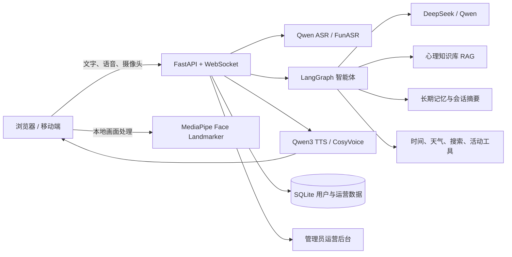

# 数字心屿 · AI 情绪陪伴数字人

> 一个融合数字人、语音交互、智能体工作流、心理学知识检索与长期记忆的开源 Web 应用。

[](https://github.com/linyuchao123/digital-human-companion/actions)
[](pyproject.toml)
[](apps/api/integrated_server.py)
[](integrated.html)

🌐 **在线体验：** [https://xiaolinyx.cloud](https://xiaolinyx.cloud)

⭐ **如果这个项目对你有帮助，欢迎点一个 Star。Issue、建议和 PR 都会成为它继续成长的动力。**

---

## 项目是什么

数字心屿围绕“小安”构建一个可持续的日常陪伴空间。用户可以通过文字、麦克风和摄像头与数字人交流；服务端智能体结合当前对话、用户授权的长期记忆和心理学知识库生成回复，再通过语音、口型、表情与动作呈现。

项目当前定位是：

- 日常问候、陪聊和生活分享；
- 非诊断性的情绪倾听与梳理；
- 带来源的心理学知识辅助回答；
- 可由用户控制的长期记忆和连续对话；
- 可观察、可测试、可部署的完整数字人应用工程。

> [!IMPORTANT]
> 数字心屿不是医疗器械，也不能替代医生、心理咨询师或紧急援助服务。摄像头与模型输出只能作为辅助交互信号，不应被理解为真实情绪诊断。若存在紧急危险或严重心理危机，请优先联系身边可信任的人和当地专业援助服务。

## 当前能力

| 能力 | 当前实现 | 状态 |
| --- | --- | --- |
| 数字人交互 | Live2D 小安、口型、眨眼、表情与轻量动作 | 可用 |
| LLM 大脑 | DeepSeek 主模型、千问备用、离线安全降级 | 可用 |
| 智能体工作流 | 意图路由、受限工具、运行轨迹、超时和失败恢复 | 可用 |
| 心理知识 RAG | 30 条内置语料、BM25、来源引用、可选 BGE 混合检索 | V1 可用 |
| 长期记忆 | 用户主动授权、账号隔离、查看、遗忘和全部清除 | 可用 |
| 对话记录 | 主对话、多会话、分页历史、模式、标题和删除 | 可用 |
| 活动记录 | 活动选择、完成、移除、统计和幂等写入 | 可用 |
| ASR | 千问云端录音识别，可选 FunASR 本地降级 | 已接通，需真机验收 |
| TTS | Qwen3/CosyVoice 多音色、流式播放、取消与口型联动 | 可用 |
| 摄像头视觉 | 浏览器本地 MediaPipe 单人脸观察和移动端小窗 | 已接通，需真机验收 |
| 注册与安全 | 邮箱验证码注册、登录、找回密码、注销和 HTTPS | 可用 |
| 运营后台 | 用户、对话轮次、模型调用、Token、费用估算和反馈 | 管理员可用 |
| 微信 / QQ 登录 | OAuth 接口已预留 | 待开放平台凭证 |
| 3D / 自定义数字人 | 路线图项目 | 尚未实现 |

更细的证据、限制和人工验收项见 [系统完成度审计](docs/system-completion-audit-2026-09-22.md)。

## 使用方式

1. 注册账号并完成邮箱验证码验证。
2. 新用户第一次进入会看到居中的使用指南；关闭后不再自动打扰，也可以随时从顶部重新打开。
3. 点击“连接数字人”。
4. 选择文字输入，或在手机端切换到“按住说话，松开发送”。
5. 根据场景选择“日常对话”或“情感对话”。
6. 在“设置与工具”中管理音色、长期记忆、活动记录和心理学知识库。

桌面端与移动端共用同一套账号和对话记录。摄像头必须在 `localhost` 或 HTTPS 页面使用。

## 系统架构



一次对话的主要路径：

```text
输入 → 身份与会话校验 → ASR（语音时）→ 意图/风险路由
    → 记忆读取 + RAG/工具 → LLM 流式生成
    → 对话与用量落库 → TTS → 数字人口型/动作
```

高风险表达优先进入安全响应，不会被普通活动推荐或工具调用覆盖。

## 技术栈

- **前端：** 原生 HTML/CSS/JavaScript、Web Audio、MediaRecorder、WebSocket、Live2D/PixiJS
- **后端：** Python 3.11/3.12、FastAPI、Pydantic、Uvicorn
- **智能体：** LangGraph、DeepSeek/OpenAI 兼容接口、千问兼容接口
- **语音：** Qwen ASR、FunASR、Qwen3 TTS、CosyVoice
- **视觉：** MediaPipe Face Landmarker；画面默认在浏览器本地处理
- **知识与记忆：** BM25、可选 Sentence Transformers、SQLite
- **部署：** Docker Compose、Nginx、Let's Encrypt、只读容器文件系统

## 快速开始

### 1. 环境要求

- Python `>=3.11,<3.13`
- Node.js 20+（仅运行前端测试时需要）
- 推荐使用支持 WebSocket、MediaRecorder 和 Web Audio 的现代浏览器

### 2. 安装

```bash
git clone https://github.com/linyuchao123/digital-human-companion.git
cd digital-human-companion
python3.12 -m venv .venv
source .venv/bin/activate
python -m pip install --upgrade pip
python -m pip install -e '.[cloud,rag,vision,dev]'
cp .env.example .env
```

编辑 `.env`，至少提供一个可用的 LLM Key。需要语音时再配置 DashScope/TTS/ASR。

```env
DEEPSEEK_API_KEY=
DASHSCOPE_API_KEY=
QWEN_API_KEY=
TTS_PROVIDER=auto
ASR_PROVIDER=qwen
PUBLIC_DEPLOYMENT=false
ALLOWED_ORIGINS=http://127.0.0.1:8800,http://localhost:8800
```

不要把真实密钥提交到 Git。`.env.example` 只保存字段和安全默认值。

### 3. 启动

```bash
python -m uvicorn apps.api.integrated_server:app \
  --host 127.0.0.1 --port 8800 --ws-max-size 3145728
```

打开 [http://127.0.0.1:8800](http://127.0.0.1:8800)。

检查服务状态：

```bash
curl --fail http://127.0.0.1:8800/api/health/ready
curl --fail http://127.0.0.1:8800/api/status
```

`ready=true` 只表示数据库和核心运行时就绪，不代表第三方云模型一定可调用。真实上线前仍应完成一次文字、录音、TTS 和摄像头人工验收。

## Docker 部署

```bash
cp .env.example .env
# 编辑 .env 后执行
docker compose --env-file .env -f infra/docker/docker-compose.yml config --quiet
docker compose --env-file .env -f infra/docker/docker-compose.yml build
docker compose --env-file .env -f infra/docker/docker-compose.yml up -d
curl --fail http://127.0.0.1:8800/api/health/ready
```

生产 Compose 只把 `8800` 绑定到宿主机回环地址，应由 Nginx 或其他反向代理提供 HTTPS。参考配置：[infra/nginx/digital-xinyu.conf](infra/nginx/digital-xinyu.conf)。

重要部署约束：

- 正式环境设置 `PUBLIC_DEPLOYMENT=true`；
- `ALLOWED_ORIGINS` 必须精确包含正式 HTTPS 域名；
- 使用平台 Secret 或权限受限的 `.env` 注入密钥；
- `app-data` 卷保存用户、会话、记忆和运营数据；
- 不要执行 `docker compose down -v`，除非你明确要删除持久数据；
- 更新前备份数据库卷，并验证回滚镜像；
- 80 端口只做 HTTPS 跳转，业务和登录不应通过明文 HTTP 提供。

详细安全边界见 [账号、安全与部署验收](docs/account-security-deployment.md)。

## 配置说明

### 模型与语音

| 变量 | 用途 |
| --- | --- |
| `DEEPSEEK_API_KEY` | 主对话模型 |
| `DEEPSEEK_MODEL` | DeepSeek 模型名 |
| `QWEN_API_KEY` | 千问备用对话模型 |
| `DASHSCOPE_API_KEY` | 千问、ASR、TTS 可复用的 DashScope Key |
| `TTS_API_KEY` | 可选的独立 TTS Key |
| `TTS_PROVIDER` | `auto`、`qwen3_tts`、`cosyvoice`、`macos_say` 或 `browser` |
| `ASR_PROVIDER` | `qwen` 或 `funasr` |
| `ASR_FALLBACK_LOCAL` | 云端 ASR 失败时是否尝试本地识别 |

### 账号与运营

| 变量 | 用途 |
| --- | --- |
| `ADMIN_USERNAMES` | 逗号分隔的管理员用户名 |
| `SMTP_*` | 邮箱验证码注册、绑定和密码找回 |
| `EMAIL_VERIFICATION_SECRET` | 验证码摘要密钥，至少 32 字符 |
| `OAUTH_PUBLIC_BASE_URL` | 微信/QQ OAuth 的 HTTPS 公网根地址 |
| `WECHAT_APP_ID/SECRET` | 微信网站应用凭证 |
| `QQ_APP_ID/SECRET` | QQ 互联应用凭证 |
| `*_PRICE_CNY_PER_MILLION` | 运营后台费用估算单价 |

完整字段与注释见 [.env.example](.env.example)。

## RAG 心理知识库

内置知识位于 [data/knowledge/psychology.json](data/knowledge/psychology.json)。每条内容包含稳定 ID、来源名称和来源链接。

- 默认使用本地 BM25，不会在服务启动时静默联网下载模型；
- 设置 `RAG_EMBEDDING_MODEL_PATH` 后可启用 BGE 等本地语义模型的混合检索；
- `/rag` 页面默认只读；写操作需要服务端 `RAG_ADMIN_TOKEN`；
- 回答会保留本轮知识来源，历史记录可以恢复引用；
- 语料或检索算法变更后应重新运行固定评测。

```bash
.venv/bin/python scripts/evaluate_agent_rag.py
```

相关说明：[心理知识语料](docs/psychology-corpus.md) · [RAG V3 验收](docs/rag-v3-acceptance.md) · [自然语言评测](docs/rag-natural-language-evaluation.md)

## 隐私与安全

- 密码使用 bcrypt，不保存或回传明文；
- 注册密码执行长度、常见弱密码和字符类别检查；
- 邮箱验证码仅保存 HMAC 摘要，有有效期、尝试次数和发送频率限制；
- 登录失败统一返回“用户名或密码错误”，未知账号也执行密码哈希校验；
- 会话、记忆、活动、反馈和模型用量按账号隔离；
- 长期记忆默认关闭，用户可以查看、删除或撤销授权；
- 摄像头帧在浏览器本地处理，服务端只接收经过约束的观察摘要；
- TTS 文本使用 POST 请求体，不放入 URL；
- 公网业务端点要求登录并限制请求体与请求频率；
- 管理员可以查看运营统计，但不应看到密码、验证码或 API Key；
- 账号注销会删除该账号拥有的会话、消息、记忆、活动和认证数据。

当前认证令牌仍由前端可读 Cookie 保存；更高安全等级的部署应继续迁移到 HttpOnly 会话，并使用 Redis/网关实现多实例共享限流。

## 运营后台

在 `.env` 配置：

```env
ADMIN_USERNAMES=your-admin-username
DEEPSEEK_INPUT_PRICE_CNY_PER_MILLION=0
DEEPSEEK_CACHED_INPUT_PRICE_CNY_PER_MILLION=0
DEEPSEEK_OUTPUT_PRICE_CNY_PER_MILLION=0
QWEN_INPUT_PRICE_CNY_PER_MILLION=0
QWEN_CACHED_INPUT_PRICE_CNY_PER_MILLION=0
QWEN_OUTPUT_PRICE_CNY_PER_MILLION=0
```

管理员登录后，顶部会出现独立的“运营后台”入口。后台包含：

- 注册用户与最近活跃；
- 模型调用次数、输入/输出 Token；
- 按配置单价计算的费用估算；
- 对话轮次和智能体运行统计；
- 用户反馈信箱与处理状态。

费用是估算值，应定期与模型供应商账单核对。普通用户看不到入口，服务端接口也会再次校验管理员角色。

## 测试与质量门禁

安装开发依赖后：

```bash
python -m pytest -q tests \
  --ignore=tests/test_asr_module.py \
  --ignore=tests/test_vision_module.py \
  --ignore=tests/test_multimodal_fusion.py

for test_file in tests/*.cjs; do node "$test_file"; done
docker compose --env-file .env -f infra/docker/docker-compose.yml config --quiet
```

三个被排除的脚本属于早期离线实验：本地 FunASR 模型下载、Windows 视觉模型路径和旧版多模态协议。它们不对应当前浏览器视觉 + 云 ASR 的生产入口，后续会迁移或移出默认测试集。

提交前还应检查：

```bash
python -m compileall -q apps packages services tests
git diff --check
```

## 主要目录

```text
apps/api/                 FastAPI、认证、运营后台和 WebSocket
services/agent/           智能体工作流、工具、记忆和知识路由
services/asr/             云端与本地语音识别
services/tts/             TTS 提供者与音色目录
services/vision/          MediaPipe 与视觉协议
services/avatar/          数字人驱动服务
digital_human_engine/     面部行为驱动模型与推理代码
data/knowledge/           心理学知识语料
eval/                     RAG、ASR、数字人和对话评测集
infra/docker/             Dockerfile 与 Compose
infra/nginx/              HTTPS 反向代理示例
docs/                     功能设计、验收证据与部署说明
tests/                    后端、前端和配置回归测试
integrated.html           当前主界面
admin.html                管理员运营后台
```

## API 入口

| 入口 | 用途 |
| --- | --- |
| `/` | 数字人主界面 |
| `/admin` | 运营后台，管理员鉴权 |
| `/rag` | 知识库浏览与管理 |
| `/api/health/ready` | 容器就绪检查 |
| `/api/status` | ASR、TTS、模型和提供者状态 |
| `/ws/main` | 主对话 WebSocket |
| `/api/sessions` | 会话与历史记录 |
| `/api/memories` | 长期记忆管理 |
| `/api/activities` | 活动记录 |
| `/api/tts/stream` | 流式语音合成 |

完整数据协议见 [protocols.md](protocols.md)。

## 已知限制

- 云模型、ASR 与 TTS 受供应商权限、地域、余额和网络状态影响；
- 真实 ASR 准确率、TTS 首音和摄像头体验必须使用目标设备验收；
- 浏览器 WebView 对麦克风、摄像头和自动播放策略存在差异；
- 默认 SQLite 和进程内限流适合单机部署，不等于多副本生产架构；
- RAG 默认 BM25 是可工作的基线，但不等于完整语义检索；
- 表情观察不是心理诊断；
- 3D 数字人、自定义数字人形象、微信/QQ 正式登录尚未完成。

## 路线图

- [ ] 微信、QQ 开放平台登录与账号绑定验收
- [ ] 3D 数字人和可授权的自定义形象
- [ ] 新的命令模式与更丰富的安全工具
- [ ] HttpOnly 会话、Redis 共享限流和多实例部署
- [ ] 更大规模的心理知识语料与混合检索评测
- [ ] iOS、安卓真机自动化与弱网语音验收
- [ ] 可观测性、成本预算和供应商账单对账

## 贡献

欢迎提交 Issue 和 PR：

1. 先描述问题、复现方式或预期体验；
2. 不要提交真实 API Key、邮箱授权码、用户数据或无授权的数字人素材；
3. 功能修改应补充相应 Python 或 `.cjs` 回归测试；
4. 涉及心理健康内容时，避免诊断承诺、治疗暗示和不可靠的危机建议；
5. 提交前运行测试、语法检查和 `git diff --check`。

项目反馈也可以直接通过站内“使用指南与反馈”发送给开发者。

## 项目背景

项目最初来源于江苏大学智能计算方向计算类赛题实践，随后持续演进为可部署的开源数字人陪伴项目。仓库保留部分赛题需求、评测和研究脚本，用于复现设计过程；当前产品能力与部署方式以本 README、`docs/` 和 `infra/` 为准。

## 作者与链接

- GitHub：[@linyuchao123](https://github.com/linyuchao123)
- X：[@xiaolinyx123](https://x.com/xiaolinyx123)
- 在线站点：[数字心屿](https://xiaolinyx.cloud)

如果你愿意体验、反馈、提交 Issue、贡献代码，或者只是点一颗 ⭐，都非常感谢。

## 许可证与使用边界

仓库当前未提供独立的标准开源许可证文件。未经作者明确授权，不应假定获得商用、再分发或模型素材授权；第三方模型、Live2D/图像素材和云服务分别受其原始许可与服务条款约束。

计划开放协作或发布正式版本前，应补充明确的 `LICENSE`、素材来源清单和第三方许可证说明。
